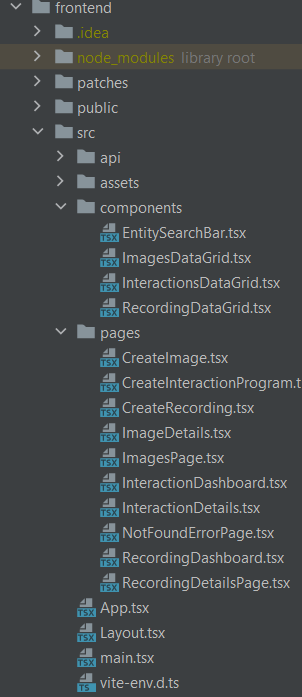

# PANDA Studio - Development and Maintenance Guide

## Table of Contents

* [Introduction](#introduction)
* [Getting Started](#getting-started)
* [Tech Stack](#tech-stack)
* [Project Structure](#project-structure)
    * [cmd](#cmd)
    * [frontend](#frontend)
    * [internal](#internal)
    * [panda_agent](#internal)
* [Architecture](#architecture)
* [Troubleshooting and Bug Tracking](#troubleshooting-and-bug-tracking)
    * [Troubleshooting Table](#troubleshooting-table)
* [Contributing, Maintenance, and Next Steps](#contributing-maintenance-and-next-steps)
    * [Potential Feature Additions and Next Steps](#potential-feature-additions-and-next-steps)
        * [High Priority Items](#high-priority-items)
        * [Low Priority Items](#low-priority-items)
    * [Pull Requests](#pull-requests)
    * [General Comments on Style](#general-comments-on-style)

# Introduction

This document covers the basics of development and maintenance in the PANDA Studio project. The first section of the document covers the process of setting up the project in a code editor or IDE and provides documentation for necessary dependencies. The next section gives a brief overview of the tech stack. The next two sections cover the project structure and some brief comments on the architecture; the architecture is covered in-depth in its own dedicated document. The final section of the document pertains to development practices when submitting bug fixes or new features. 

# Getting Started

Since PANDA Studio operates as a standalone Docker container, it is possible to expedite the process of building and running the software. This only relies on Docker being properly installed. Directions for running PANDA Studio through Docker can be found here: https://github.com/panda-re/panda_studio/blob/main/readme.md.

To begin working with PANDA Studio, it is helpful to have an understanding of how PANDA itself works. A PANDA introductory class can be found here: https://github.com/panda-re/panda_class. This repo walks through the basic features of PANDA and will provide some insight into the kinds of things PANDA Studio can be used for. 

To begin with PANDA and PANDA Studio, developers will need either an Ubuntu Linux system running version 20.04 or higher, or a Mac system on version 12.3.1 or higher. There are several options for getting a suitable development environment: a physical machine, virtual machine, or Windows Subsystem for Linux (WSL). WSL is recommended over a VM for performance reasons.

The next task for obtaining the repos is to install git. Directions can be found at the following link: https://git-scm.com/book/en/v2/Getting-Started-Installing-Git. Git is required as it is responsible for the source control of the project. Since no official releases of PANDA Studio are provided yet, git is the best method to obtain the source code.

A few other installations will be necessary. Namely, Go, npm, and Docker will be required to build the project properly. Links for the installation guides for each can be found below. For Linux users, it is recommended to use the Node Version Manager (nvm). This will enable multiple versions of node to be used on the same machine. Furthermore, if Windows users are using WSL, it is possible to link Docker Desktop to an instance of WSL without having to install Docker in that environment.

* Go: https://go.dev/doc/install (v1.19.4)
* Docker: https://docs.docker.com/get-docker (v4.15.0)
* Node: https://nodejs.dev/en/learn/how-to-install-nodejs (v14.21.2)
* Nvm (recommended): https://github.com/nvm-sh/nvm (v0.39.2)

Developers may run into issues with dependencies on particular versions of node or some other software. Console output is usually clear enough that developers should be able to resolve these issues on their own.

With all of the appropriate software installed, one can run an “npm install” inside the root directory of the PANDA Studio project to install all of the front-end dependencies. After importing all of the appropriate dependencies used in the API, a developer should be able to build the system from source and begin developing.

# Tech Stack

PANDA Studio is built using the following technologies:

* Docker: https://docs.docker.com/

  * Used for containerizing different parts of the application
      
* React: https://react.dev/

  * Frontend web framework
      
* ElasticUI: https://elastic.github.io/eui/#/

  * Component library, used for frontend UI components
  
* TypeScript: https://www.typescriptlang.org/docs/

  * Scripting language for frontend
  
* Go: https://go.dev/doc/

  * API implementation language

* MongoDB: https://www.mongodb.com/docs/

  * Data storage for documents, such as recording/image metadata
  
* Python: https://docs.python.org/3/

  * Used to make the wrapper for PyPANDA

* QEMU: https://www.qemu.org/documentation/

  * The emulation technology with which PANDA is built

* MinIO: https://min.io/docs/minio/linux/index.html

  * Stores non-document data, such as recording files and images

* OpenAPI: https://swagger.io/specification/

  * Specifies API endpoints

* gRPC: https://grpc.io/docs/

  * Use to send remote procedure calls from API to PANDA agent

Links to documentation for each are provided above, as it is outside the scope of this document to go into significant detail about each technology. Different parts of the system will rely on different technologies; for example, the API is built using Go, the gRPC agent is written in Python, and the front-end uses React. Some rudimentary information is given in the [research document](./RESEARCH.md). Developers and maintainers of the software system can seek out necessary documentation as they find it necessary. 

# Project Structure

Inside the root project directory, there are four folders worth noting that encompass most of PANDA Studio’s functionality. The name and a brief description of each folder is discussed below.

## [cmd](../cmd)

This folder contains two other folders, but it is primarily where the entrypoint to the application is. Within this folder is the panda_api folder, which contains the code that starts the API server ([panda_server.go](../cmd/panda_api/panda_server.go)). It also contains a [test executor](../cmd/panda_executor_test/panda_executor_test.go) which is used to test the back-end functionality of the software. Any changes to the run configuration of the server itself would be done here.

    

## [frontend](../frontend)

This folder contains all front-end application code. All files relating to the UI and other front-end application logic live here. Within this folder are several other folders, but the src folder contains most of the frontend code. Within the src folder are the components and pages folders. Many of the components contain the actual logic for API calls and the displayed information; the pages folder contains pages which use these components.

    

## [internal](../internal)

This folder contains the model and database code that MongoDB uses, as well as the configuration for MongoDB. Within this folder is the [api folder](../internal/api/), which has implementations for each API endpoint in their respective files (images.go, programs.go, etc.). The [db folder](../internal/db/) contains both the models, as Go structs, for each item and the repos folder contains the logic for getting and storing data to and from MongoDB and MinIO object storage. The endpoints written in the api directory call directly to the implementations in the [db/repos](../internal/db/repos/) folder. Unlike the panda_api folder in cmd, the api folder here contains implementations whereas the other simply starts the API.

    

## [panda_agent](../panda_agent)

This folder contains the back-end PANDA agent. It is responsible for actually executing the commands that are sent over gRPC in PANDA. For example, a certain interaction program may contain a START_RECORDING instruction. This instruction is parsed and then sent over gRPC to the PANDA agent, where the instruction will be executed.

    

# Architecture

References to the architecture can be found in the corresponding PANDA Studio Architecture document. This document provides a high-level overview of the PANDA Studio architecture as well as several iterations of the attribute-driven design (ADD) process. This document aims to give new developers a look at the overall architecture while also providing some rationale behind the various design decisions. 

Again, it is outside the scope of this document to discuss architecture in detail. When looking to add new features or bug fixes to PANDA Studio, the best place to start will be the architecture document. The previous section of this document also lays out the project structure as it could be seen in an IDE or editor such as VS Code. Using these two pieces of information, developers can begin to find the areas in the code where they wish to make changes.

# Troubleshooting and Bug Tracking

## Troubleshooting Table

This section covers common issues as well as potential steps that could resolve them. When troubleshooting PADNA Studio, some issues may involve changes to the codebase itself whereas others simply need small adjustments to the where and when the code is running. 

The other part of this section is dedicated to keeping a list of known bugs and may suggest potential resolutions to them. This is simply to track the current issues with PANDA Studio so developers can contribute to the project by fixing these issues.

<table>
  <tr>
   <td><strong>Problem</strong>
   </td>
   <td><strong>Cause</strong>
   </td>
   <td><strong>Options</strong>
   </td>
  </tr>
  <tr>
   <td>Response 500 - rpc error: not able to connect to agent
   </td>
   <td>The image object being used is not properly configured and needs updated
   </td>
   <td>
<ul>

<li>Recreate the image from scratch

<li>Edit the image details to fix any issues

<li>Try with a new image file
</li>
</ul>
   </td>
  </tr>
  <tr>
   <td>Webpage loads but only errors shown (list.filter undefined)
   </td>
   <td>Typically means the API is not running or client can not connect
   </td>
   <td>
<ul>

<li>Check the network connection to ensure it is stable

<li>Restart or start the API
</li>
</ul>
   </td>
  </tr>
  <tr>
   <td>Response 500 - rpc error: code = Unavailable desc
   </td>
   <td>Multiple causes
<ul>

<li>The MinIO object storage DB may not be running

<li>
</li>
</ul>
   </td>
   <td>
<ul>

<li>Ensure the MinIO Docker container is running

<li>Restart the MinIO, API, and Mongo containers
</li>
</ul>
   </td>
  </tr>
  <tr>
   <td>Response 500 - db error: server selection error:...
   </td>
   <td>The MongoDB container is not running
   </td>
   <td>Start or restart the MongoDB container
   </td>
  </tr>
</table>

# Contributing, Maintenance, and Next Steps

PANDA Studio is an open-source project, and as such it is expected that many users will also be developers. This means that bug fixes as well as entirely new features will be done by the same people. Throughout the development of the initial project, the team established guidelines that are believed to be helpful to the project in several ways. These guidelines help ensure code quality and correctness, and they provide a framework for tracking new features and issues that arise in development. Some of these guidelines are presented below.

## Potential Feature Additions and Next Steps

This section covers the immediate vision for the project. During the course of development, many things were changed, altered, or ignored due to time or technical constraints. The goal of this section then is to detail which items are most important for future development teams going forward. Of course, these are only recommendations and needn’t be followed exactly, but we believe making these changes early on before adding other features will greatly improve both the development experience and the product itself.

### High Priority Items

* Unit/Integration Tests for the API
    * At the moment, only backend tests exist to verify functionality. The API is still relatively simple so unit tests haven’t been necessary, but implementing these as soon as possible would help ensure the quality of development going forward. Specifically, using some mocking framework and writing tests for the API code would be one of our next steps. More details on testing plans can be found in the Test Plan document.
* Polymorphic Interaction Types
    * In order to support new types of interactions (filesystem and network), we would make the interaction types polymorphic and perhaps change the format in which they are stored. This would mean implementing a custom marshal/unmarshal function for the interaction program data.
* Implement Filesystem and Network Interactions
    * After the interaction types have been made polymorphic, introducing new interaction types would enable full usage of PANDA Studio to work completely with PANDA.
* Recording Replay Functionality
    * This functionality exists in the backend but has no frontend implementation. Implementing this feature involves being able to replay recordings from the PANDA Studio web client.
* Progress Bars
    * Currently, there is no way to view image file upload or recording creation progress in the frontend, there is just a loading screen that disappears once the process is complete or errors. Adding in a way to view the progress could be very helpful to users.
* Timeout parameter

### Low Priority Items

* gRPC Streaming
    * One feature that was implemented, but left behind due to time constraints, conflicts, and because it was an extra feature was utilizing gRPC streams to give more frequent updates on long-running items such as replays. This can be found in the [23-PANDA-VM-logs branch](https://github.com/panda-re/panda_studio/tree/23-PANDA-VM-logs).

* Argument parity with PyPANDA
    * Some PyPANDA functions such as `run_serial_cmd` have additional arguments such as a timeout that are not incorporated in gRPC or protobuf. It may be worth adding those arguments or other PyPANDA functions as interactions.

* Features which have no frontend support
    * This is an all-encompassing category which covers everything that has backend implementation but no current frontend functionality. This is classified as lower priority due to the fact that the items listed in the other category will make implementation of these features easier. Two of these are specifically listed above (Record/Replay and other interaction types).

## Pull Requests

For any feature or bug fix, an appropriately named issue and pull request should be opened. The pull request should be associated with that particular issue. The description of each pull request should contain a brief description of the feature being added (or bug being fixed). In order to merge into the main branch, the PR will have to pass a series of checks; although not all of them are required, developers should ensure that there are no failing checks before merging into main. Finally, two approvals are required on every PR. This was originally done to ensure that a subject matter expert from both the back-end and front-end could each examine the code being merged. It is recommended to have at least two reviewers on every PR going forward.

When approving PRs, it is highly recommended to pull the branch and run it locally. Often times, a branch will pass all of the checks and look functionally correct. Despite this, issues have crept in due to a lack of testing. The best way to ensure something works as expected is to pull the code and verify it runs and produces expected results. 

## General Comments on Style

Code style is important for this project and should not be overlooked. General best practices should be followed when submitting pull requests for new features or bug fixes. Specifically, developers and maintainers should aim to emphasize code reuse, as many aspects of the system vary only slightly from one another. As an example, consider the dashboard pages for recordings, images, and interaction programs. Many of the items displayed on each of these pages differ only slightly from one another, meaning this is a place where code can easily be reused. The principle of code reuse helps to eliminate widespread changes throughout the system and makes a developer’s job easier.
