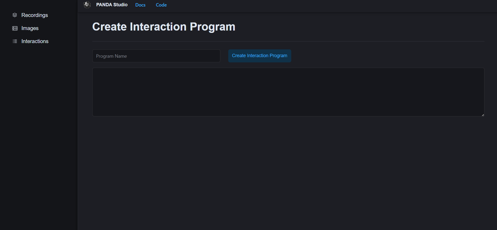
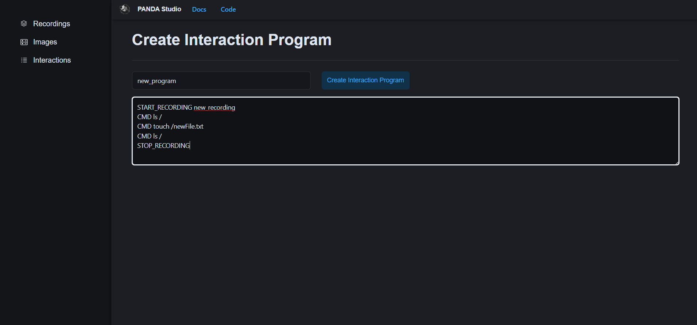
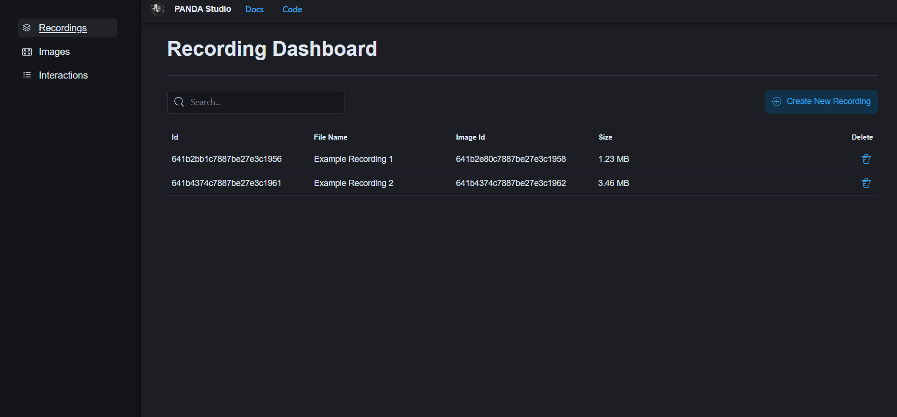
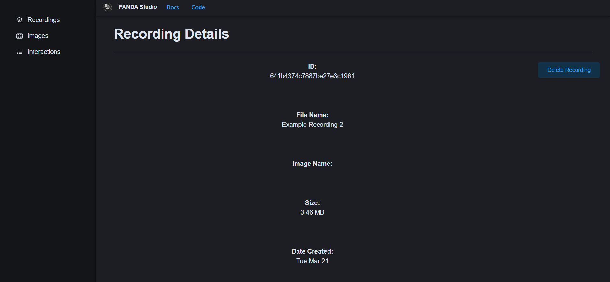

# PANDA Studio User Guide

## Table of Contents
* [Introduction](#introduction)
* [PANDA Studio Basics](#panda-studio-basics)
* [Creating Your First Recording](#creating-your-first-recording)
    * [Creating the VM Image](#creating-the-vm-image)
    * [Writing an Interaction Program](#writing-an-interaction-program)
    * [Creating a Recording](#creating-a-recording)
* [Application Tasks](#application-tasks)
    * [Upload Valid Image](#upload-valid-image)
    * [Derive New Image](#derive-new-image)
    * [Delete Existing Image](#delete-existing-image)
    * [Edit Existing Image](#edit-existing-image)
    * [Create New Interaction Program](#create-new-interaction-program)
    * [Delete Existing Interaction Program](#delete-existing-interaction-program)
    * [Create Recording](#create-recording)
    * [Delete Recording](#delete-recording)
* [Interaction Program Format](#interaction-program-format)

# Introduction

This document is a user guide for the PANDA Studio software. The first section of this document gives a high-level overview of the PANDA Studio application. The second section provides a basic walkthrough of creating a recording from scratch. The third section provides some instructions for performing basic tasks in the system, namely the CRUD operations for recordings, images, and interaction programs. Since this project is open-source, many users will be building from source. Instructions for this workflow are provided in the Development and Maintenance Guide. The final section of the document contains reference screenshots which aim to show some of the primary screens that are referenced in the first section.

# PANDA Studio Basics

When opening PANDA Studio for the first time, the user will be placed on the Recording Dashboard page. There are three primary dashboards in the application; one for Recordings, one for Images, and one for Interaction Programs. A user can navigate between these different pages simply by clicking one from the sidebar on the left. It is unlikely there will be any Recordings, Images, or Interaction Programs present when the user first opens the application. In order to create these items, follow the directions from the second section of this document.

The PANDA Studio UI was made to be consistent and intuitive. Each dashboard page has roughly the same layout and functionality. By clicking on an item on a dashboard page, the user will navigate to the details page for that particular item. The details pages display information about the item such as its name, size, date created, etc., although this varies depending on what the item is (Recording, Image, or Interaction Program). There are also various buttons with options for things that can be done with that item, such as deleting it. In the case of Images, a user also has the ability to derive new images or edit an image’s details. 

For more in-depth instructions on how to use the software, see the section of this guide titled “Application Tasks.”

# Creating Your First Recording

This section will walk through, step by step, the full process of creating/uploading an Image, writing an Interaction Program, and using both of those items to create a Recording.

## Creating the VM Image

1\. Begin by navigating to the Images tab using the navigation bar on the left.

2\. From there, click the “Upload Base Image” button shown on the right.

3\. Fill out the form with the following information:

    Name: Ubuntu 22.04
    Description: Tutorial Image
    Architecture: x86_64
    OS: Ubuntu
    Prompt: root@ubuntu:.*#
    CD ROM: leave blank
    Snapshot: leave blank
    Memory: 1024M
    Extra Args: leave blank
    
4\. When complete, it should look identical to the following image:

 

5\. For this example, we will use a URL to an image file as opposed to uploading an image file from the local machine. Copy and paste this URL into the Image URL box: https://panda.re//qcows/linux/ubuntu/2204/x86_64/ubuntu-2204.qcow2

6\. Click the “Submit” button. A popup should appear that says “Uploading Image”. This may take several minutes for larger image files. Once the popup closes, the image has been successfully uploaded to the dashboard and its details can be viewed by clicking on it.

## Writing an Interaction Program

1\. Navigate to the Interactions tab from the left navigation bar.

2\. Enter a name for the program, such as “Tutorial Program”

3\. Next, specify the program instructions as follows:

    START_RECORDING new_recording
    CMD cd ~
    CMD ls
    CMD touch example_file.txt
    CMD ls
    STOP_RECORDING
    
4\. When completed, the page should look like the following:

    

5\. Finally, click the “Create Interaction Program” button. The newly created program should appear in the Programs dashboard, and you can view the details by clicking on it.

## Creating a Recording

1\. Navigate to the Recording Dashboard by clicking the Recordings tab on the left navigation bar.

2\. Click the “Create New Recording” button.

3\. Enter a name for the recording, such as “Tutorial Recording”.

4\. Click on the Image and Interaction Program that were just created to select them. When a user has many programs or images, they can search by name or ID to filter through them so scrolling through the whole list isn’t necessary.

5\. Once selected, the page should look like the following:

6\. Click the “Create Recording” button.

7\. The newly created recording should appear on the dashboard page. Clicking on it will take the user to its details page.

Now that the basics of creating a recording have been covered, it is time to make something more interesting! Play around with different custom VM images and various interaction programs to generate recordings that are more useful. For detailed instructions on other application tasks, see the section of this document titled “Application Tasks.”

# Application Tasks

This section describes the different tasks a user can perform with PANDA Studio. Although the functionality is still somewhat limited, the following capabilities are currently supported:

* Upload Valid Image
* Derive New Image
* Delete Existing Image
* Edit Existing Image
* Create New Interaction Program
* Delete Existing Interaction Program
* Create Recording
* Delete Recording

Below are step-by-step instructions for how to perform each of these tasks in PANDA Studio with accompanying images. For a more in-depth look at PANDA itself, see the PANDA class which provides a tutorial and introduction to PANDA, found here: https://github.com/panda-re/panda_class.

## Upload Valid Image

1\. Navigate to the Images dashboard by clicking the Images tab on the left
    

2\. Click the Upload Base Image button

3\. Fill in the Image Name

4\. Fill in the Description for the image

5\. Fill in the Config fields for the image

    Architecture, OS, prompt, and memory amount are required

6\. Select valid image file to upload

    Note: A user can also paste in a valid URL to a qcow file and upload images that way.

7\. Click Submit

8\. Dashboard should contain new image

## Derive New Image

1\. Navigate to the Images Dashboard by clicking the Images tab on the left

2\. Select existing Image 

3\. Click the Derive New Image button

4\. Fill out the New Image Name and Size fields

5\. Fill out the Docker Image name field, as it would be done during a “docker pull” command

6\. Fill out the Extra Args field associated with the Image    

   Note: The size field here refers to the system memory, not the actual image size.

7\. Click the Create button

## Delete Existing Image

1\. Navigate to the Images Dashboard by clicking the Images tab on the left

2\. Select existing Image

3\. Click Delete Image button

    Note: A user can also click the delete icon displayed on the right of any image from the dashboard page to delete it.

## Edit Existing Image

1\. Navigate to the Images Dashboard by clicking the Images tab on the left

2\. Select existing Image

3\. Click Update Image Info button

4\. Edit the image details

5\. Click the Submit button

## Create New Interaction Program

1\. Navigate to the Interaction Program dashboard by clicking the Programs tab on the left

2\. Click the Create New Interaction button

3\. Fill in the name field for the new interaction program

4\. Fill in the instructions for the new interaction program in the text area
    See the section on interaction programs for more details on the format for instruction lists

5\. Click the Create Interaction Program button

## Delete Existing Interaction Program

1\. Navigate to the Interaction Program dashboard by clicking the Programs tab on the left

2\. Select an existing interaction program

3\. Click Delete Interaction button

    Note: A user can also click the delete icon displayed on the right of any program from the dashboard page to delete it.

## Create Recording

1\. Navigate to the Recording Dashboard by clicking the Recordings tab on the left

2\. Click the Create New Recording button

3\. Enter the name of the Recording to be created in the Name field

4\. Select the image to be used by searching or scrolling through the list of Images

5\. Select the interaction program to be used by searching or scrolling through the list of Interaction Programs

6\. Click the Create Recording button

## Delete Recording

1\. Navigate to the Recording Dashboard by clicking the Recordings tab on the left

2\. Select an existing recording

3\. Click Delete Recording button

    Note: A user can also click the delete icon displayed on the right of any recording from the dashboard page to delete it.
    
## Download Recording
1\.Navigate to the  Recording Dashboard by clicking the Recordings tab on the left

2\.Click on an existing recording

3\.Click the download icons for each recording file

# Interaction Program Format

Interaction programs have a domain specific language (DSL) that must be followed in order to be valid. The format is similar to Dockerfiles, in that each item has a particular tag/instruction. The format is as follows:

\#Comment

INSTRUCTION arguments

Currently, PANDA Studio supports the following instructions.

* START_RECORDING argument
    * This instruction starts a recording. It takes one argument, the name of the recording. This name is appended to the one provided when creating recordings.
* CMD argument
    * This instruction takes one augment, a bash command. These are simply serial commands that can be fed into a terminal. Some examples of possible commands are:
        * ls
        * cd ~
        * echo “PANDA Studio is so cool!”
        * cat example_file.txt
    * In practice, it is unlikely that such simple commands would be used. More likely, a user will be running some malware of some kind or some other such program which needs to be analyzed.
* STOP_RECORDING
    * This is a standalone instruction that simply stops the recording. It should appear at the end of each recording when the user wishes to stop recording commands.

In the future, PANDA Studio will aim to support network and filesystem instructions as well.
